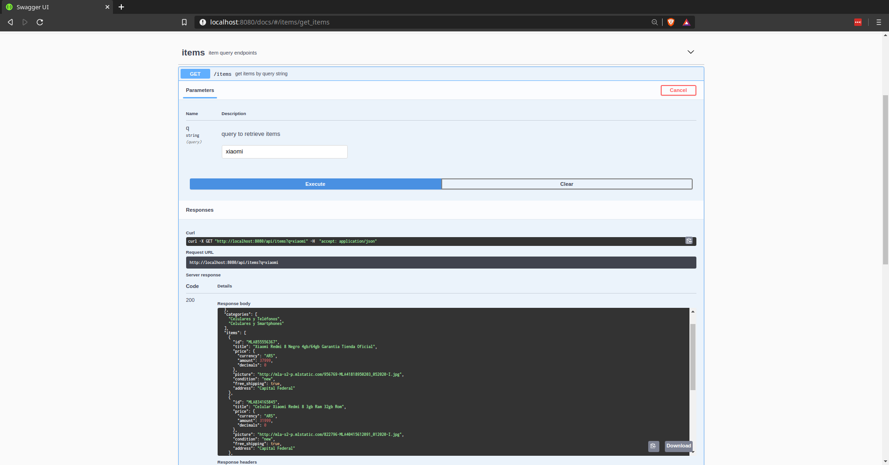

# MELI Challenge: BFF de flujo de busqueda de productos

## Descripción

Implementado en NodeJs, en ES6, con servidor express, transpilado con babel, con pruebas automáticas realizadas con [Jest](https://jestjs.io/) (unitarias) y supertest (integracion)

## Arquitectura

La estructura de proyecto se basa en [clean architecture](https://www.goodreads.com/book/show/18043011-clean-architecture) teniendo el contenido separado pensado en la separacion de responsabilidades, los principios SOLID (principalmente el principio de responsabilidad unica, inversion de dependencias) y el patron de inversion de control.

## Instalación de aplicación en local

### Requisitos previos

- Asegurarse de tener nodejs instalado en el sistema.
  [NodeJS](https://nodejs.org)
- Una vez instalado recomiendo instalar globalmente yarn (gestor de paquetes optimizado en comparación a npm (gestor de paquetes de node)) [Yarn](https://yarnpkg.com/lang/en/). Para instalar globalmente ejecutar en terminal

>     npm install -g yarn

### Ejecución

- Clonar proyecto
- Ir a carpeta de proyecto
- ejecutar

>     npm install

o

>     yarn

- abrir proyecto con IDE o editor de texto favorito (recomendado [vsCode](https://code.visualstudio.com/))

- para desarrollo

>     yarn dev

Con esto se levanta la aplicacion en servidor

>     yarn watch:dev

Para dejar el servidor escuchando cambios (nodemon) (livereload)

- para ejecucion de pruebas

>     yarn test

para ejecutar todas las pruebas (tanto unitarias como integracion) y dejar en modo escucha a cambios en pruebas.

>     yarn coverage

para obtener la cobertura de código, abrir archivo coverage/lcov-report/index.html para ver en navegador el reporte de cobertura de código.

Tambien se puede ejecutar aplicacion en modo desarrollo, en base a contenedor docker. realizar la ejecucion de los comandos

>     yarn run docker-build

para realizar la construccion del contenedor e imagen y

>     yarn run docker-run

para ejecutar el contenedor

## Probando la API

por defecto la aplicacion se levanta en el puerto 8080, por lo cual la ruta base es http://localhost:8080

la api posee 2 endpoints los cuales son

### listado de items por busqueda

>     GET: /api/items?q=:query

el cual permite entregar el lista de items encontrados dado un query string

```
{
"author": {
    "name": "string",
    "lastname": "string"
  },
  "categories": [
    "string"
  ],
  "items": [
    {
      "id": "string",
      "title": "string",
      "price": {
        "currency": "string",
        "amount": 0,
        "decimals": 0
      },
      "picture": "string",
      "condition": "string",
      "free_shipping": true,
      "address": "string"
    }
  ]
}
```

---

### item por id

>     GET: /api/items/:id

---

el cual permite obtener la informacion de un item buscado por su id (uri param)

```
{
  "author": {
    "name": "string",
    "lastname": "string"
  },
  "categories": [
    "string"
  ],
  "item": {
    "id": "string",
    "title": "string",
    "price": {
      "currency": "string",
      "amount": 0,
      "decimals": 0
    },
    "picture": "string",
    "condition": "string",
    "free_shipping": true,
    "sold_quantity": 0,
    "description": "string",
    "address": "string"
  }
}
```

---

Tambien para evaluar la api se genero un apidocs (basado en [Open Api 3.0](https://swagger.io/specification/)) en [swagger](https://swagger.io/) el cual se puede acceder desde la ruta

>     /docs



## Notas

- Existe un archivo de configuracion de variables de entorno, el archivo se llama **.env** (ubicado en carpeta raiz de solución), en este archivo se definieron la ruta de la api de meli y de el puerto a utilizar, por defecto esta configurado en el puerto **:8080** al igual que el puerto expuesto por docker y la red por la cual accede las cuales estan configuradas e en el comando script **docker-run** dentro del archivo **package.json**

- Se implementa hook de git el cual ejecuta el comando de test, si la cobertura de codigo es mas baja que el threshold configurado , el push sobre el repositorio no se podria realizar. Estos son los threshold configurados en archivo **package.json**

```
{
  "branches": 85,
  "functions": 85,
  "lines": 85,
  "statements": 85
}
```
